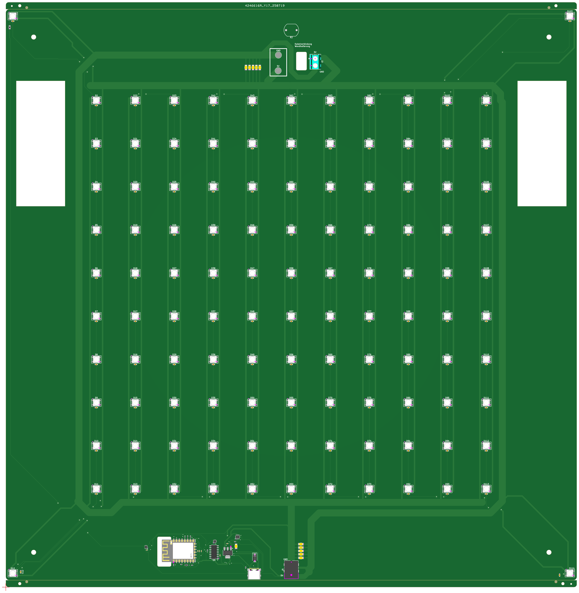
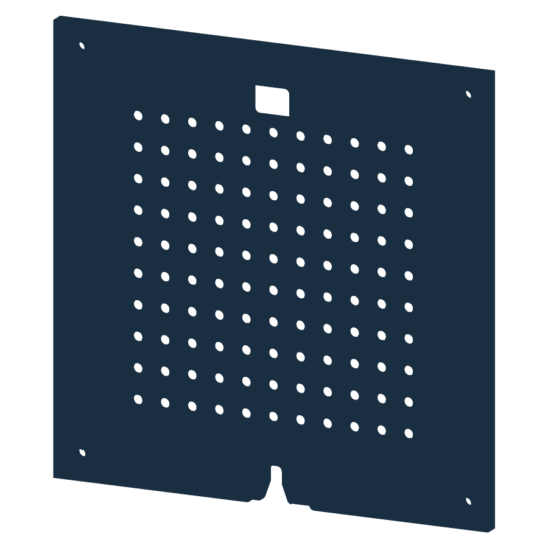

# Word Clock — Full-PCB build

After a decade of work on workclocks based on other open-source work, I've spent the last year or so on optimizing this design towards manufacturability. I've decided to publish this to contribute my little part. It might not be the cheapest, but AFAIK this is the easiest to assemble as it comes with a full PCB that can be ordered at any PCBA-Shop, here I refer to JLCPCB. The housing can be 3D printed with a BambuLab H2S or a similar-sized 3D printer (in parts and assembled using Acetone) or, if you have access to one, CNC-milled from PE or other material. When those parts are done, it's a simple drop in with a couple of screws and a bit of glue to include magnets, diffusor foil, LDR and power.

This is a **full-PCB** design — all **114 RGB LEDs (SK6812)** are mounted directly on a single board, driven by an
ESP8266 (ESP-12E), powered from a 5 V supply. No LED strips, no perfboard.

It runs the open-source [QlockWork](https://github.com/ch570512/Qlockwork) firmware (ESP8266).

| | |
|---|---|
| **Grid** | 11 × 10 letters + 4 corner dots = **114 LEDs** |
| **LEDs** | SK6812 PLCC4 5.0 mm (addressable RGB) |
| **Controller** | ESP8266 / ESP-12E |
| **Power** | 5 V / 6 A, DC barrel input |
| **Board** | single PCB carrying the full matrix |
| **Housing** | two options: 3D-printed *or* CNC-machined |
| **Firmware** | [QlockWork](https://github.com/ch570512/Qlockwork) |



> _The full-PCB board._



> _Housing body (450 × 450 mm), rendered from the STEP file._

---

## What's in this repository

```
pcb/
  gerbers/         Gerber + drill files
  assembly/        BOM + CPL (JLCPCB SMT assembly)
housing/
  housing-body.step   main body — mill from solid (CNC) or convert/print
  base-plate.3mf      base plate — 3D-print, slicer-ready
  back-plate.3mf      back plate — 3D-print, slicer-ready
BOM.md             full build cost (PCB + parts + housing)
README.md          this file
LICENSE            CERN-OHL-S v2   ·   LICENSE-docs   CC-BY-SA 4.0
```

## How to build it

1. **Order the PCB (assembled).** Upload `pcb/gerbers/gerbers-upload.zip` to a fab (e.g. JLCPCB),
   then add `pcb/assembly/BOM_jlcpcb.xlsx` + `CPL_jlcpcb.xlsx` for SMT assembly of the LEDs /
   caps / diodes. See [BOM.md](BOM.md) for costs (~€72/board all-in at qty 5).
2. **Make the housing** — pick one route:
   - **3D-printed:** slice `housing/base-plate.3mf` + `housing/back-plate.3mf`. Depending on the printer, the housing cannot be printed in one piece. I've seperated these components into "puzzle parts" based on the print bed of a BambuLab H2S. The parts can then be fused using Acetone.
   - **CNC-machined:** mill `housing/housing-body.step` from a solid block of PE.
   - 9× Ø10×5 mm neodymium magnets hold the front/back together.
3. **Flash QlockWork** to the ESP8266 — see [Firmware & pinout](#firmware--pinout). A working
   `Configuration.h` for this board is included. NOTE: The clock needs to have external power while flashing to not overload the USB-port.

This is the exact board revision that was fabricated and **verified to work**. One issue is
known on this revision:

- **Power-supply polarity is reversed.** Connect the 5 V supply with **inverted polarity**
  (swap **+** / **−**).

## Firmware & pinout

The clock runs **[QlockWork](https://github.com/ch570512/Qlockwork)** on the ESP8266. The
included **`Configuration.h`** is a working config for this board — drop it into your QlockWork
build. Key hardware settings it uses:

| Setting | Value |
|---|---|
| LED data line | **GPIO15 / D8** (`PIN_LEDS_DATA`) |
| LDR (auto-brightness) | **A0** (`PIN_LDR`) |
| On-board status LED | GPIO2 / D4 |
| LED type | SK6812, **`NEOPIXEL_RGB`**, `NEO_GRB + NEO_KHZ800` |
| Pixel count | `NUMPIXELS 115` (114 LEDs + 1 unused index — harmless) |
| Matrix layout | `LED_LAYOUT_VERTICAL_1` (matches the vertical LED columns) |
| Front cover | `FRONTCOVER_DE_DE` (German — change to your language) |
| Disabled | buttons, IR receiver, buzzer, DHT22, RTC backup |

## Licence

**Copyright © 2026 mcstech1.**

- **Hardware & mechanical files** (Gerbers, BOM/CPL, STEP, 3MF): **CERN-OHL-S v2** —
  see [`LICENSE`](LICENSE).
- **Documentation, text & images:** **CC-BY-SA 4.0** — see [`LICENSE-docs`](LICENSE-docs).
- **Firmware** (QlockWork) is not included. The bundled **`Configuration.h`** stems from
  [QlockWork](https://github.com/ch570512/Qlockwork) and is licensed under **GNU GPL v3** (that
  project's licence), **not** the licences above.

If you build one, a link back is appreciated. Enjoy! ⏰
